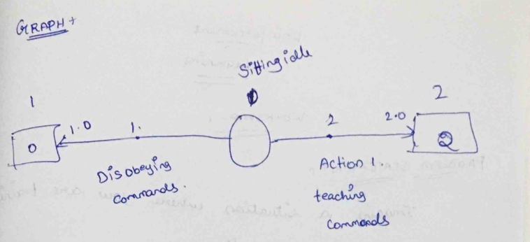

# MDP REPRESENTATION

## AIM:

To represent a Markov Decision Process(MDP) problem in the following ways.

  1. Text representation
  2. Graphical representation
  3. Python - Dictonary representation

## PROBLEM STATEMENT:


### Problem Description

Imagine a situation where you are training a dog to obey your commands

### State Space

1. Sitting Idle
2. Obeying Commands
3. Disobeying Commands

### Sample State

Sitting Idle

### Action Space

1. Moving Right, Left
2. Sitting and Standing
3. Running and Jumping

### Sample Action

Giving commands

### Reward Function

+1: sitting, standing, running, jumping, moving left or right.
 0:  otherwise.

### Graphical Representation



## PYTHON REPRESENTATION:
```python
P = {
    0:{
        0: [(1.0,0,0.0,True)],
        1: [(1.0,0,0.0,True)]
    },
    1:{
        0: [(1.0,0,0.0,True)],
        1: [(1.0,2,1.0,True)]
    },
    2:{
        0: [(1.0,2,0.0,True)],
        1: [(1.0,2,0.0,True)]
    }
}
```
## OUTPUT:
```python
{0: {0: [(1.0, 0, 0.0, True)], 1: [(1.0, 0, 0.0, True)]},
 1: {0: [(1.0, 0, 0.0, True)], 1: [(1.0, 2, 1.0, True)]},
 2: {0: [(1.0, 2, 0.0, True)], 1: [(1.0, 2, 0.0, True)]}}
```
## RESULT:

Thus the given Markov Decision Process(MDP) problem is represented in the following ways.

  1. Text representation
  2. Graphical representation
  3. Python - Dictonary representation
